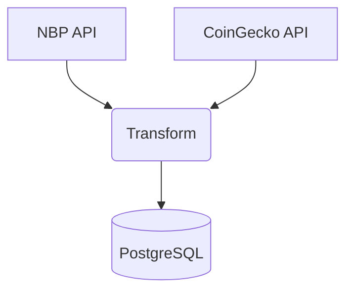

# BigCurrencyETL

Lekki pipeline ETL w Pythonie, który **raz dziennie** pobiera kursy walut z NBP oraz ceny Bitcoina i Etheru z CoinGecko, łączy je w jeden zbiór danych i zapisuje do PostgreSQL. 

---

## Spis treści

1. [Wymagania](#wymagania)
2. [Konfiguracja](#konfiguracja)
3. [Szybki start](#szybki-start)
4. [Uruchomienie w Docker Compose](#docker-compose)
5. [Kroki ETL](#kroki-etl)
6. [Przykładowe logi](#przykladowe-logi)
7. [Autor](#autor)

---

## Wymagania  <a name="wymagania"></a>

* Python ≥ 3.10
* PostgreSQL ≥ 14
* (Opcjonalnie) Docker + Docker Compose

---

## Konfiguracja  <a name="konfiguracja"></a>

1. Skuduj przykładowy plik konfiguracyjny i uzupełnij dane dostępu do bazy:

   ```bash
   cp config.example.yaml config.yaml
   ```
2. Edytuj `config.yaml`:

   ```yaml
   postgres:
     host: db            # nazwa usługi / host
     port: 5432
     db:   etl
     user: etl
     password: etl
     sslmode: disable    # lokalnie "disable", w chmurze np. "require"

   sources:
     nbp_api:    "http://api.nbp.pl/api/exchangerates/tables/A?format=json"
     crypto_api: "https://api.coingecko.com/api/v3/simple/price?ids=bitcoin,ethereum&vs_currencies=usd"
   ```

> Pliki z danymi wrażliwymi (`config.yaml`, `.env`) są ignorowane przez Git → patrz `.gitignore`.

---

## Szybki start  <a name="szybki-start"></a>

```bash
python -m venv .venv && source .venv/bin/activate   # Windows: .venv\Scripts\activate
pip install -r requirements.txt
python main.py                                      # uruchamia cały pipeline
```

---

## Docker Compose  <a name="docker-compose"></a>

Jeśli wolisz kontenery:

```bash
docker compose up --build
```

Docker Compose postawi Postgresa i odpali pipeline w osobnym kontenerze. Logi pojawią się w konsoli.

---

## Kroki ETL  <a name="kroki-etl"></a>

1. **Extract** – pobranie kursów NBP oraz cen krypto z CoinGecko
2. **Transform** – ujednolicenie danych, dodanie timestampu `fetched_at`
3. **Load** – zapis do tabeli `currency_rates` w PostgreSQL

### Mini‑diagram



---

## Przykładowe logi  <a name="przykladowe-logi"></a>

```
=== BigCurrencyETL START ===
[1/4] Extracting NBP rates…
[2/4] Extracting Crypto prices…
[3/4] Transforming data…
  → Combined 30 fiat + 2 crypto rows
[4/4] Loading into PostgreSQL…
✓ Load complete.
=== BigCurrencyETL FINISHED ===
```

---

## Autor  <a name="autor"></a>

Mateusz Dalke · [GitHub](https://github.com/SculptTechProject) · [LinkedIn](https://linkedin.com/in/mateusz-dalke-12b56a2a8)
