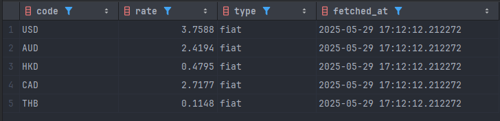

# 🎬 BigCurrencyETL

A dramatic ETL pipeline that extracts fiat exchange rates from NBP and crypto prices from CoinGecko, transforms and merges them, then loads into PostgreSQL.

---

## 📋 Configuration

1. **Copy** the example config and fill in your credentials:

   ```bash
   cp config.example.yaml config.yaml
   ```
2. **Edit** `config.yaml`:

   ```yaml
   postgres:
     host: YOUR_HOST
     port: YOUR_PORT
     db: YOUR_DB
     user: YOUR_USER
     password: YOUR_PASSWORD
     sslmode: require
     sslrootcert: ca.pem

   sources:
     nbp_api: "http://api.nbp.pl/api/exchangerates/tables/A?format=json"
     crypto_api: "https://api.coingecko.com/api/v3/simple/price?ids=bitcoin,ethereum&vs_currencies=usd"
   ```
3. **Download** the Aiven CA certificate (`ca.pem`) and place it next to your `config.yaml`.

> 🔒 Sensitive files (`config.yaml`, `.env`) are ignored by Git. See `.gitignore`.

---

## 🚦 Steps

1. **Extract** NBP rates & Crypto prices
2. **Transform** into unified table with timestamps
3. **Load** into `exchange_rates` table in PostgreSQL

---

## 🚀 Run Locally

```bash
pip install -r requirements.txt
python main.py
```

---

## 🐳 Docker (optional)

1. Build the image:

   ```bash
   docker build -t bigcurrencyetl .
   ```

docker build -t bigcurrencyetl .

````
2. Run the container (mount your config & cert):  
```bash
docker run --rm \
-v $(pwd)/config.yaml:/app/config.yaml \
-v $(pwd)/ca.pem:/app/ca.pem \
bigcurrencyetl
````

---

## 📈 Logs Sample

```
=== BigCurrencyETL START ===
[1/4] Extracting NBP rates…
[2/4] Extracting Crypto prices…
[3/4] Transforming data…
  → Combined 30 fiat + 2 crypto rows
[4/4] Loading into PostgreSQL…
✅ Load complete.
=== BigCurrencyETL FINISHED ===
```
---

## 🪃 Sample Output



---

## 🧑‍💻 Author

Mateusz Dalke – [GitHub](https://github.com/SculptTechProject) | [LinkedIn](https://linkedin.com/in/mateusz-dalke-12b56a2a8)
